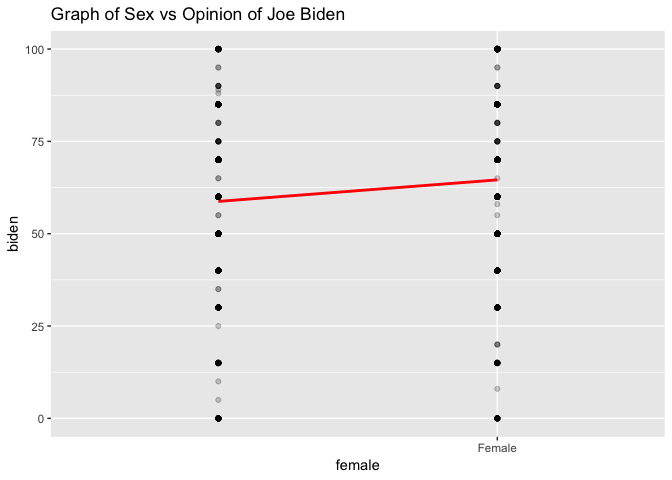
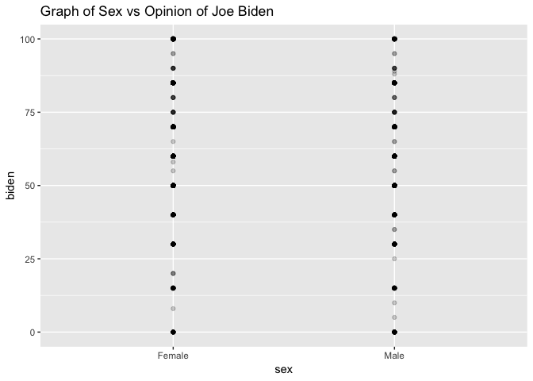

Joe Biden
================
Abby Bergman
11/6/2018

``` r
#Do women display higher feeling thermometer ratings for Joe Biden than men?

#get the data
library(readr)
biden <- read_csv("data/biden.csv")
```

    ## Parsed with column specification:
    ## cols(
    ##   biden = col_double(),
    ##   female = col_double(),
    ##   pid = col_double(),
    ##   age = col_double(),
    ##   educ = col_double()
    ## )

``` r
#Estimate a basic (single variable) linear regression model of the relationship between gender and feelings towards Joe Biden.
biden 
```

    ## # A tibble: 2,323 x 5
    ##    biden female   pid   age  educ
    ##    <dbl>  <dbl> <dbl> <dbl> <dbl>
    ##  1    90      0     0    19    12
    ##  2    70      1     0    51    14
    ##  3    60      0     1    27    14
    ##  4    50      1     0    43    14
    ##  5    60      1     2    38    14
    ##  6    85      1     0    27    16
    ##  7    60      1     1    28    12
    ##  8    50      0     0    31    15
    ##  9    50      1     1    32    13
    ## 10    70      0     0    51    14
    ## # ... with 2,313 more rows

``` r
bid_mod <- lm(biden ~ female, data = biden)
coef(bid_mod)
```

    ## (Intercept)      female 
    ##   58.743341    5.833322

``` r
summary(bid_mod)
```

    ## 
    ## Call:
    ## lm(formula = biden ~ female, data = biden)
    ## 
    ## Residuals:
    ##     Min      1Q  Median      3Q     Max 
    ## -64.577 -14.577   1.257  20.423  41.257 
    ## 
    ## Coefficients:
    ##             Estimate Std. Error t value Pr(>|t|)    
    ## (Intercept)   58.743      0.811  72.437  < 2e-16 ***
    ## female         5.833      1.087   5.367 9.03e-08 ***
    ## ---
    ## Signif. codes:  0 '***' 0.001 '**' 0.01 '*' 0.05 '.' 0.1 ' ' 1
    ## 
    ## Residual standard error: 23.31 on 1861 degrees of freedom
    ##   (460 observations deleted due to missingness)
    ## Multiple R-squared:  0.01524,    Adjusted R-squared:  0.01471 
    ## F-statistic:  28.8 on 1 and 1861 DF,  p-value: 9.026e-08

``` r
#Calculate predicted values, graph the relationship between the two variables using the predicted values, and determine whether there appears to be a significant relationship.

grid <- biden %>% 
  data_grid(female, biden) 
grid
```

    ## # A tibble: 50 x 2
    ##    female biden
    ##     <dbl> <dbl>
    ##  1      0     0
    ##  2      0     5
    ##  3      0     8
    ##  4      0    10
    ##  5      0    15
    ##  6      0    20
    ##  7      0    25
    ##  8      0    30
    ##  9      0    35
    ## 10      0    40
    ## # ... with 40 more rows

``` r
grid <- grid %>% 
  add_predictions(bid_mod)
    

grid
```

    ## # A tibble: 50 x 3
    ##    female biden  pred
    ##     <dbl> <dbl> <dbl>
    ##  1      0     0  58.7
    ##  2      0     5  58.7
    ##  3      0     8  58.7
    ##  4      0    10  58.7
    ##  5      0    15  58.7
    ##  6      0    20  58.7
    ##  7      0    25  58.7
    ##  8      0    30  58.7
    ##  9      0    35  58.7
    ## 10      0    40  58.7
    ## # ... with 40 more rows

``` r
#make new df with predicted values
pred <- augment(bid_mod, type.predict = "response")

ggplot(data = pred, aes(x = female, y = biden)) +
  geom_point(alpha = .2) +
  geom_line(data = pred, 
            aes(y=.fitted), 
            color = "red", size = 1) +
  labs(title = "Graph of Sex vs Opinion of Joe Biden") + scale_x_discrete(limits = c("0", "1"), labels = c("Female", "Male"))
```



``` r
#to do: transform female to male/female factor

#Estimate a basic (single variable) linear regression model of the relationship between gender and feelings towards Joe Biden.
biden <- biden%>%
  mutate(female = factor(female))%>%
  mutate(sex = if_else(female == 1, "Female", "Male"))%>%
  mutate(sex = factor(sex))

bid_mod <- lm(biden ~ sex, data = biden)
coef(bid_mod)
```

    ## (Intercept)     sexMale 
    ##   64.576663   -5.833322

``` r
summary(bid_mod)
```

    ## 
    ## Call:
    ## lm(formula = biden ~ sex, data = biden)
    ## 
    ## Residuals:
    ##     Min      1Q  Median      3Q     Max 
    ## -64.577 -14.577   1.257  20.423  41.257 
    ## 
    ## Coefficients:
    ##             Estimate Std. Error t value Pr(>|t|)    
    ## (Intercept)  64.5767     0.7238  89.223  < 2e-16 ***
    ## sexMale      -5.8333     1.0870  -5.367 9.03e-08 ***
    ## ---
    ## Signif. codes:  0 '***' 0.001 '**' 0.01 '*' 0.05 '.' 0.1 ' ' 1
    ## 
    ## Residual standard error: 23.31 on 1861 degrees of freedom
    ##   (460 observations deleted due to missingness)
    ## Multiple R-squared:  0.01524,    Adjusted R-squared:  0.01471 
    ## F-statistic:  28.8 on 1 and 1861 DF,  p-value: 9.026e-08

``` r
#Calculate predicted values, graph the relationship between the two variables using the predicted values, and determine whether there appears to be a significant relationship.

grid <- biden %>% 
  data_grid(sex, biden) 
grid
```

    ## # A tibble: 50 x 2
    ##    sex    biden
    ##    <fct>  <dbl>
    ##  1 Female     0
    ##  2 Female     5
    ##  3 Female     8
    ##  4 Female    10
    ##  5 Female    15
    ##  6 Female    20
    ##  7 Female    25
    ##  8 Female    30
    ##  9 Female    35
    ## 10 Female    40
    ## # ... with 40 more rows

``` r
grid <- grid %>% 
  add_predictions(bid_mod)
    

grid
```

    ## # A tibble: 50 x 3
    ##    sex    biden  pred
    ##    <fct>  <dbl> <dbl>
    ##  1 Female     0  64.6
    ##  2 Female     5  64.6
    ##  3 Female     8  64.6
    ##  4 Female    10  64.6
    ##  5 Female    15  64.6
    ##  6 Female    20  64.6
    ##  7 Female    25  64.6
    ##  8 Female    30  64.6
    ##  9 Female    35  64.6
    ## 10 Female    40  64.6
    ## # ... with 40 more rows

``` r
#make new df with predicted values
pred <- augment(bid_mod, type.predict = "response")

ggplot(data = pred, 
       aes(x = sex, y = biden)) +
  geom_point(alpha = .2) +
  geom_line(data = pred, 
            aes(y=.fitted), 
            color = "red", size = 1) +
  labs(title = "Graph of Sex vs Opinion of Joe Biden")
```



``` r
#to do: transform female to male/female factor
```

``` r
#Build the best predictive linear regression model of attitudes towards Joe Biden given the variables you have available. In this context, “best” is defined as the model with the lowest MSE. Compare at least three different model formulations (aka different combinations of variables). Use 10-fold cross-validation to avoid a biased estimate of MSE.

biden_age_pid <- lm(biden ~ age+pid, data = biden)

biden_pid <- lm(biden ~ pid, data = biden)

biden_age <- lm(biden ~ age, data = biden)

#for age+pid 
# function to generate assessment statistics for titanic model

holdout_results_pid_age <- function(splits) {
  # Fit the model to the training set
  mod <- glm(biden ~ age+pid, data = analysis(splits))

  # Save the heldout observations
  holdout <- assessment(splits)

  # `augment` will save the predictions with the holdout data set
  res <- augment(mod, newdata = holdout) %>% 
    mutate(.resid = biden -.fitted)

  # Return the assessment data set with the additional columns
  res
}

#for pid
# function to generate assessment statistics for titanic model

holdout_results_pid <- function(splits) {
  # Fit the model to the training set
  mod <- glm(biden ~ pid, data = analysis(splits))

  # Save the heldout observations
  holdout <- assessment(splits)

  # `augment` will save the predictions with the holdout data set
  res <- augment(mod, newdata = holdout) %>% 
    mutate(.resid = biden -.fitted)

  # Return the assessment data set with the additional columns
  res
}

#for age
# function to generate assessment statistics for titanic model

holdout_results_age <- function(splits) {
  # Fit the model to the training set
  mod <- glm(biden ~ age, data = analysis(splits))

  # Save the heldout observations
  holdout <- assessment(splits)

  # `augment` will save the predictions with the holdout data set
  res <- augment(mod, newdata = holdout) %>% 
    mutate(.resid = biden -.fitted)

  # Return the assessment data set with the additional columns
  res
}

#remove nas
biden_new <- biden%>%
  na.omit()
  

# CV for pid and age
pid_age_cv10 <- vfold_cv(data = biden_new, v = 10) %>%
  mutate(results = map(splits, holdout_results_pid_age),
         mse = map_dbl(results, ~ mean(.$.resid ^ 2)))
mean(pid_age_cv10$mse, na.rm = TRUE)
```

    ## [1] 402.3524

``` r
#error = 401.055

#CV for pid
pid_cv10 <- vfold_cv(data = biden_new, v = 10) %>%
  mutate(results = map(splits, holdout_results_pid),
         mse = map_dbl(results, ~ mean(.$.resid ^ 2)))
mean(pid_cv10$mse, na.rm = TRUE)
```

    ## [1] 401.6874

``` r
#error = 402.2789

#CV for age
age_cv10 <- vfold_cv(data = biden_new, v = 10) %>%
  mutate(results = map(splits, holdout_results_age),
         mse = map_dbl(results, ~ mean(.$.resid ^ 2)))
mean(age_cv10$mse, na.rm = TRUE)
```

    ## [1] 550.6561

``` r
#error = 551.0212
```

The model that takes into account both party ID and age has the lowest error rate (401.0555). The error for the model with only party ID was only slightly higher (402.2789) but the model that only took age into account was much higher (551.0212).

``` r
#what happens if we include gender in the model?
biden_age_pid_gender <- lm(biden ~ age+pid+female, data = biden)

holdout_results_age_pid_gender <- function(splits) {
  # Fit the model to the training set
  mod <- glm(biden ~ age+pid+female, data = analysis(splits))

  # Save the heldout observations
  holdout <- assessment(splits)

  # `augment` will save the predictions with the holdout data set
  res <- augment(mod, newdata = holdout) %>% 
    mutate(.resid = biden -.fitted)

  # Return the assessment data set with the additional columns
  res
}

age_pid_gender_cv10 <- vfold_cv(data = biden_new, v = 10) %>%
  mutate(results = map(splits, holdout_results_age_pid_gender),
         mse = map_dbl(results, ~ mean(.$.resid ^ 2)))
mean(age_pid_gender_cv10$mse, na.rm = TRUE)
```

    ## [1] 399.5266

``` r
#error = 397.4093
```

Here we see that when we include the gender variable in the model, the error rate is lowered to 397.4093 so this is a better model.
