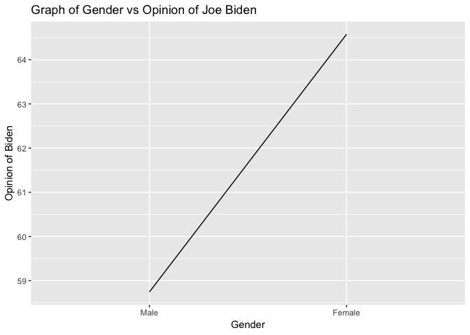

Exploring the Relationship Between Joe Biden Ratings and Gender
================
Abby Bergman
11/6/2018

``` r
#Do women display higher feeling thermometer ratings for Joe Biden than men?

#get the data
library(readr)
biden <- read_csv("data/biden.csv")
```

``` r
#Estimate a basic (single variable) linear regression model of the relationship between gender and feelings towards Joe Biden.

bid_mod <- lm(biden ~ female, data = biden)
```



    ## 
    ## Call:
    ## lm(formula = biden ~ female, data = biden)
    ## 
    ## Residuals:
    ##     Min      1Q  Median      3Q     Max 
    ## -64.577 -14.577   1.257  20.423  41.257 
    ## 
    ## Coefficients:
    ##             Estimate Std. Error t value Pr(>|t|)    
    ## (Intercept)   58.743      0.811  72.437  < 2e-16 ***
    ## female         5.833      1.087   5.367 9.03e-08 ***
    ## ---
    ## Signif. codes:  0 '***' 0.001 '**' 0.01 '*' 0.05 '.' 0.1 ' ' 1
    ## 
    ## Residual standard error: 23.31 on 1861 degrees of freedom
    ##   (460 observations deleted due to missingness)
    ## Multiple R-squared:  0.01524,    Adjusted R-squared:  0.01471 
    ## F-statistic:  28.8 on 1 and 1861 DF,  p-value: 9.026e-08

As shown above, the relationship between feelings towards biden and gender is significant with a p-value of less than .05 (p=9.03e-08).

``` r
#Build the best predictive linear regression model of attitudes towards Joe Biden given the variables you have available. In this context, “best” is defined as the model with the lowest MSE. Compare at least three different model formulations (aka different combinations of variables). Use 10-fold cross-validation to avoid a biased estimate of MSE.

biden_age_pid <- lm(biden ~ age+pid, data = biden)

biden_pid <- lm(biden ~ pid, data = biden)

biden_age <- lm(biden ~ age, data = biden)

#for age+pid 
# function to generate assessment statistics for titanic model

holdout_results_pid_age <- function(splits) {
  # Fit the model to the training set
  mod <- glm(biden ~ age+pid, data = analysis(splits))

  # Save the heldout observations
  holdout <- assessment(splits)

  # `augment` will save the predictions with the holdout data set
  res <- augment(mod, newdata = holdout) %>% 
    mutate(.resid = biden -.fitted)

  # Return the assessment data set with the additional columns
  res
}

#for pid
# function to generate assessment statistics for titanic model

holdout_results_pid <- function(splits) {
  # Fit the model to the training set
  mod <- glm(biden ~ pid, data = analysis(splits))

  # Save the heldout observations
  holdout <- assessment(splits)

  # `augment` will save the predictions with the holdout data set
  res <- augment(mod, newdata = holdout) %>% 
    mutate(.resid = biden -.fitted)

  # Return the assessment data set with the additional columns
  res
}

#for age
# function to generate assessment statistics for titanic model

holdout_results_age <- function(splits) {
  # Fit the model to the training set
  mod <- glm(biden ~ age, data = analysis(splits))

  # Save the heldout observations
  holdout <- assessment(splits)

  # `augment` will save the predictions with the holdout data set
  res <- augment(mod, newdata = holdout) %>% 
    mutate(.resid = biden -.fitted)

  # Return the assessment data set with the additional columns
  res
}

#remove nas
biden_new <- biden%>%
  na.omit()
  

# CV for pid and age
pid_age_cv10 <- vfold_cv(data = biden_new, v = 10) %>%
  mutate(results = map(splits, holdout_results_pid_age),
         mse = map_dbl(results, ~ mean(.$.resid ^ 2)))
mean(pid_age_cv10$mse, na.rm = TRUE)
```

    ## [1] 401.0195

``` r
#error = 401.055

#CV for pid
pid_cv10 <- vfold_cv(data = biden_new, v = 10) %>%
  mutate(results = map(splits, holdout_results_pid),
         mse = map_dbl(results, ~ mean(.$.resid ^ 2)))
mean(pid_cv10$mse, na.rm = TRUE)
```

    ## [1] 402.2054

``` r
#error = 402.2789

#CV for age
age_cv10 <- vfold_cv(data = biden_new, v = 10) %>%
  mutate(results = map(splits, holdout_results_age),
         mse = map_dbl(results, ~ mean(.$.resid ^ 2)))
mean(age_cv10$mse, na.rm = TRUE)
```

    ## [1] 549.7225

``` r
#error = 551.0212
```

The model that takes into account both party ID and age has the lowest error rate (401.0555). The error for the model with only party ID was only slightly higher (402.2789) but the model that only took age into account was much higher (551.0212).

``` r
#what happens if we include gender in the model?
biden_age_pid_gender <- lm(biden ~ age+pid+female, data = biden)

holdout_results_age_pid_gender <- function(splits) {
  # Fit the model to the training set
  mod <- glm(biden ~ age+pid+female, data = analysis(splits))

  # Save the heldout observations
  holdout <- assessment(splits)

  # `augment` will save the predictions with the holdout data set
  res <- augment(mod, newdata = holdout) %>% 
    mutate(.resid = biden -.fitted)

  # Return the assessment data set with the additional columns
  res
}

age_pid_gender_cv10 <- vfold_cv(data = biden_new, v = 10) %>%
  mutate(results = map(splits, holdout_results_age_pid_gender),
         mse = map_dbl(results, ~ mean(.$.resid ^ 2)))
mean(age_pid_gender_cv10$mse, na.rm = TRUE)
```

    ## [1] 397.0449

``` r
#error = 397.4093
```

Here we see that when we include the gender variable in the model, the error rate is lowered to 397.4093 so this is a better model.
