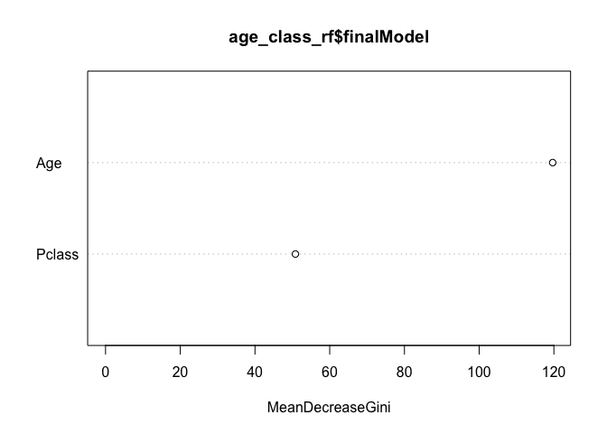
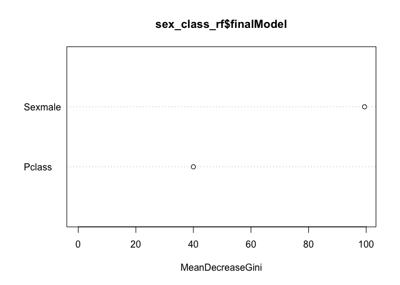
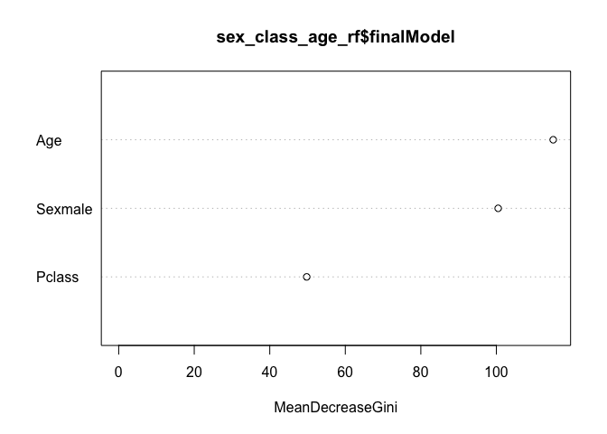

Exploring Titanic Data
================
Abby Bergman
11/6/2018

``` r
#Estimate three different logistic regression models with Survived as the response variable. You may use any combination of the predictors to estimate these models. Don’t just reuse the models from the notes.

#survival by fare
survive_fare <- glm(Survived ~ Fare, 
                    data = titanic_train, 
                    family = binomial)
summary(survive_fare)
```

    ## 
    ## Call:
    ## glm(formula = Survived ~ Fare, family = binomial, data = titanic_train)
    ## 
    ## Deviance Residuals: 
    ##     Min       1Q   Median       3Q      Max  
    ## -2.4906  -0.8878  -0.8531   1.3429   1.5942  
    ## 
    ## Coefficients:
    ##              Estimate Std. Error z value Pr(>|z|)    
    ## (Intercept) -0.941330   0.095129  -9.895  < 2e-16 ***
    ## Fare         0.015197   0.002232   6.810 9.79e-12 ***
    ## ---
    ## Signif. codes:  0 '***' 0.001 '**' 0.01 '*' 0.05 '.' 0.1 ' ' 1
    ## 
    ## (Dispersion parameter for binomial family taken to be 1)
    ## 
    ##     Null deviance: 1186.7  on 890  degrees of freedom
    ## Residual deviance: 1117.6  on 889  degrees of freedom
    ## AIC: 1121.6
    ## 
    ## Number of Fisher Scoring iterations: 4

``` r
#survival by class
survive_class <- glm(Survived ~ Pclass, 
                     data = titanic_train, 
                     family = binomial)
summary(survive_class)
```

    ## 
    ## Call:
    ## glm(formula = Survived ~ Pclass, family = binomial, data = titanic_train)
    ## 
    ## Deviance Residuals: 
    ##     Min       1Q   Median       3Q      Max  
    ## -1.4390  -0.7569  -0.7569   0.9367   1.6673  
    ## 
    ## Coefficients:
    ##             Estimate Std. Error z value Pr(>|z|)    
    ## (Intercept)  1.44679    0.20743   6.975 3.06e-12 ***
    ## Pclass      -0.85011    0.08715  -9.755  < 2e-16 ***
    ## ---
    ## Signif. codes:  0 '***' 0.001 '**' 0.01 '*' 0.05 '.' 0.1 ' ' 1
    ## 
    ## (Dispersion parameter for binomial family taken to be 1)
    ## 
    ##     Null deviance: 1186.7  on 890  degrees of freedom
    ## Residual deviance: 1084.4  on 889  degrees of freedom
    ## AIC: 1088.4
    ## 
    ## Number of Fisher Scoring iterations: 4

``` r
#survival by sex
survive_sex <- glm(Survived ~ Sex, 
                   data = titanic_train, 
                   family = binomial)
summary(survive_sex)
```

    ## 
    ## Call:
    ## glm(formula = Survived ~ Sex, family = binomial, data = titanic_train)
    ## 
    ## Deviance Residuals: 
    ##     Min       1Q   Median       3Q      Max  
    ## -1.6462  -0.6471  -0.6471   0.7725   1.8256  
    ## 
    ## Coefficients:
    ##             Estimate Std. Error z value Pr(>|z|)    
    ## (Intercept)   1.0566     0.1290   8.191 2.58e-16 ***
    ## Sexmale      -2.5137     0.1672 -15.036  < 2e-16 ***
    ## ---
    ## Signif. codes:  0 '***' 0.001 '**' 0.01 '*' 0.05 '.' 0.1 ' ' 1
    ## 
    ## (Dispersion parameter for binomial family taken to be 1)
    ## 
    ##     Null deviance: 1186.7  on 890  degrees of freedom
    ## Residual deviance:  917.8  on 889  degrees of freedom
    ## AIC: 921.8
    ## 
    ## Number of Fisher Scoring iterations: 4

``` r
#Calculate the leave-one-out-cross-validation error rate for each model. Which model performs the best?
#survive_fare

#begin cross validation
loocv_data <- loo_cv(titanic_train)
loocv_data
```

    ## # Leave-one-out cross-validation 
    ## # A tibble: 891 x 2
    ##    splits       id        
    ##    <list>       <chr>     
    ##  1 <S3: rsplit> Resample1 
    ##  2 <S3: rsplit> Resample2 
    ##  3 <S3: rsplit> Resample3 
    ##  4 <S3: rsplit> Resample4 
    ##  5 <S3: rsplit> Resample5 
    ##  6 <S3: rsplit> Resample6 
    ##  7 <S3: rsplit> Resample7 
    ##  8 <S3: rsplit> Resample8 
    ##  9 <S3: rsplit> Resample9 
    ## 10 <S3: rsplit> Resample10
    ## # ... with 881 more rows

``` r
holdout_results <- function(splits){

  mod <- glm(Survived ~ Fare, data = analysis(splits)
             )  
  holdout <- assessment(splits)
  
  res <- augment(mod, newdata = holdout) %>%
    mutate(.resid = Survived -.fitted)
  res
}

#use map
loocv_data$results <- map(loocv_data$splits, holdout_results)
loocv_data$mse <- map_dbl(loocv_data$results, ~mean(.$.resid^2))
loocv_data
```

    ## # Leave-one-out cross-validation 
    ## # A tibble: 891 x 4
    ##    splits       id         results             mse
    ##    <list>       <chr>      <list>            <dbl>
    ##  1 <S3: rsplit> Resample1  <tibble [1 × 16]> 0.136
    ##  2 <S3: rsplit> Resample2  <tibble [1 × 16]> 0.115
    ##  3 <S3: rsplit> Resample3  <tibble [1 × 16]> 0.398
    ##  4 <S3: rsplit> Resample4  <tibble [1 × 16]> 0.178
    ##  5 <S3: rsplit> Resample5  <tibble [1 × 16]> 0.398
    ##  6 <S3: rsplit> Resample6  <tibble [1 × 16]> 0.443
    ##  7 <S3: rsplit> Resample7  <tibble [1 × 16]> 0.199
    ##  8 <S3: rsplit> Resample8  <tibble [1 × 16]> 0.157
    ##  9 <S3: rsplit> Resample9  <tibble [1 × 16]> 0.336
    ## 10 <S3: rsplit> Resample10 <tibble [1 × 16]> 0.104
    ## # ... with 881 more rows

``` r
#overall MSE
loocv_data %>%
  summarize(mse_fare = mean(mse))
```

    ## # Leave-one-out cross-validation 
    ## # A tibble: 1 x 1
    ##   mse_fare
    ##      <dbl>
    ## 1    0.222

The mean squared error for survival by fare is 0.222

``` r
#survive_class

#begin cross validation
loocv_data <- loo_cv(titanic_train)
loocv_data
```

    ## # Leave-one-out cross-validation 
    ## # A tibble: 891 x 2
    ##    splits       id        
    ##    <list>       <chr>     
    ##  1 <S3: rsplit> Resample1 
    ##  2 <S3: rsplit> Resample2 
    ##  3 <S3: rsplit> Resample3 
    ##  4 <S3: rsplit> Resample4 
    ##  5 <S3: rsplit> Resample5 
    ##  6 <S3: rsplit> Resample6 
    ##  7 <S3: rsplit> Resample7 
    ##  8 <S3: rsplit> Resample8 
    ##  9 <S3: rsplit> Resample9 
    ## 10 <S3: rsplit> Resample10
    ## # ... with 881 more rows

``` r
holdout_results <- function(splits){

  mod <- glm(Survived ~ Pclass, data = analysis(splits)
             )  
  holdout <- assessment(splits)
  
  res <- augment(mod, newdata = holdout) %>%
    mutate(.resid = Survived -.fitted)
  res
}

#use map
loocv_data$results <- map(loocv_data$splits, holdout_results)
loocv_data$mse <- map_dbl(loocv_data$results, ~mean(.$.resid^2))
loocv_data
```

    ## # Leave-one-out cross-validation 
    ## # A tibble: 891 x 4
    ##    splits       id         results              mse
    ##    <list>       <chr>      <list>             <dbl>
    ##  1 <S3: rsplit> Resample1  <tibble [1 × 16]> 0.415 
    ##  2 <S3: rsplit> Resample2  <tibble [1 × 16]> 0.0616
    ##  3 <S3: rsplit> Resample3  <tibble [1 × 16]> 0.0616
    ##  4 <S3: rsplit> Resample4  <tibble [1 × 16]> 0.0616
    ##  5 <S3: rsplit> Resample5  <tibble [1 × 16]> 0.0616
    ##  6 <S3: rsplit> Resample6  <tibble [1 × 16]> 0.198 
    ##  7 <S3: rsplit> Resample7  <tibble [1 × 16]> 0.198 
    ##  8 <S3: rsplit> Resample8  <tibble [1 × 16]> 0.568 
    ##  9 <S3: rsplit> Resample9  <tibble [1 × 16]> 0.129 
    ## 10 <S3: rsplit> Resample10 <tibble [1 × 16]> 0.568 
    ## # ... with 881 more rows

``` r
#overall MSE
loocv_data %>%
  summarize(mse_class = mean(mse))
```

    ## # Leave-one-out cross-validation 
    ## # A tibble: 1 x 1
    ##   mse_class
    ##       <dbl>
    ## 1     0.210

The mean squared error rate for survival by class is 0.210.

``` r
#survive_sex

#begin cross validation
loocv_data <- loo_cv(titanic_train)

#

holdout_results <- function(splits){

  mod <- glm(Survived ~ Sex, data = analysis(splits)
             )  
  holdout <- assessment(splits)
  
  res <- augment(mod, newdata = holdout) %>%
    mutate(.resid = Survived -.fitted)
  res
}

#use map
loocv_data$results <- map(loocv_data$splits, holdout_results)
loocv_data$mse <- map_dbl(loocv_data$results, ~mean(.$.resid^2))
loocv_data
```

    ## # Leave-one-out cross-validation 
    ## # A tibble: 891 x 4
    ##    splits       id         results              mse
    ##    <list>       <chr>      <list>             <dbl>
    ##  1 <S3: rsplit> Resample1  <tibble [1 × 16]> 0.0358
    ##  2 <S3: rsplit> Resample2  <tibble [1 × 16]> 0.0670
    ##  3 <S3: rsplit> Resample3  <tibble [1 × 16]> 0.0358
    ##  4 <S3: rsplit> Resample4  <tibble [1 × 16]> 0.0358
    ##  5 <S3: rsplit> Resample5  <tibble [1 × 16]> 0.660 
    ##  6 <S3: rsplit> Resample6  <tibble [1 × 16]> 0.0358
    ##  7 <S3: rsplit> Resample7  <tibble [1 × 16]> 0.0358
    ##  8 <S3: rsplit> Resample8  <tibble [1 × 16]> 0.0358
    ##  9 <S3: rsplit> Resample9  <tibble [1 × 16]> 0.0358
    ## 10 <S3: rsplit> Resample10 <tibble [1 × 16]> 0.0358
    ## # ... with 881 more rows

``` r
#overall MSE
loocv_data %>%
  summarize(mse_sex = mean(mse))
```

    ## # Leave-one-out cross-validation 
    ## # A tibble: 1 x 1
    ##   mse_sex
    ##     <dbl>
    ## 1   0.167

The mean squared error rate for survival by sex is 0.167. Because survival by sex has the lowest MSE (.167), the model of survival by sex is the best.

``` r
#Now estimate three random forest models. Generate random forests with 500 trees apiece.
#convert qualitative to factors so that random forest will work
titanic_tree_data <- titanic_train %>%
  mutate(Survived = if_else(Survived == 1, "Survived", "Died"),
         Survived = as.factor(Survived),
         Sex = as.factor(Sex))

#make data ready for rf
titanic_rf_data <- titanic_tree_data %>%
  select(Survived, Pclass, Sex, Age, SibSp, Parch, Fare, Embarked) %>% #select variables I want
  na.omit() #get rid of NAs


#run rf for age + Pclass
age_class_rf <- train(Survived ~ Age + Pclass, data = titanic_rf_data,
                   method = "rf",
                   ntree = 500, #how many trees
                   trControl = trainControl(method = "oob")) #set method
```

    ## note: only 1 unique complexity parameters in default grid. Truncating the grid to 1 .

``` r
#run rf for sex + Pclass
sex_class_rf <- train(Survived ~ Sex + Pclass, data = titanic_rf_data,
                   method = "rf",
                   ntree = 500,
                   trControl = trainControl(method = "oob"))
```

    ## note: only 1 unique complexity parameters in default grid. Truncating the grid to 1 .

``` r
sex_class_rf
```

    ## Random Forest 
    ## 
    ## 714 samples
    ##   2 predictor
    ##   2 classes: 'Died', 'Survived' 
    ## 
    ## No pre-processing
    ## Resampling results:
    ## 
    ##   Accuracy   Kappa    
    ##   0.7913165  0.5341426
    ## 
    ## Tuning parameter 'mtry' was held constant at a value of 2

``` r
#run rf for sex + Pclass
sex_class_age_rf <- train(Survived ~ Sex + Pclass + Age, data = titanic_rf_data,
                   method = "rf",
                   ntree = 500,
                   trControl = trainControl(method = "oob"))
```

    ## note: only 2 unique complexity parameters in default grid. Truncating the grid to 2 .

``` r
#Generate variable importance plots for each random forest model. Which variables seem the most important?
#age and class
randomForest::varImpPlot(age_class_rf$finalModel)
```



``` r
#sex and class
randomForest::varImpPlot(sex_class_rf$finalModel)
```



``` r
#sex, class, and age
randomForest::varImpPlot(sex_class_age_rf$finalModel)
```

 The three variable difference plots allow us to see which variables are most important in each model. For the age and class random forest, age is the more important variable. For the sex and class random forest, sex is the more important varible. For the random forest that takes into account sex, age, and class, age is the most important variable, followed by sex and class.

``` r
#Calculate the out-of-bag error rate for each random forest model. Which performs the best?
#age and class
age_class_rf$finalModel
```

    ## 
    ## Call:
    ##  randomForest(x = x, y = y, ntree = 500, mtry = param$mtry) 
    ##                Type of random forest: classification
    ##                      Number of trees: 500
    ## No. of variables tried at each split: 2
    ## 
    ##         OOB estimate of  error rate: 31.65%
    ## Confusion matrix:
    ##          Died Survived class.error
    ## Died      341       83   0.1957547
    ## Survived  143      147   0.4931034

``` r
#sex and class
sex_class_rf$finalModel
```

    ## 
    ## Call:
    ##  randomForest(x = x, y = y, ntree = 500, mtry = param$mtry) 
    ##                Type of random forest: classification
    ##                      Number of trees: 500
    ## No. of variables tried at each split: 2
    ## 
    ##         OOB estimate of  error rate: 20.87%
    ## Confusion matrix:
    ##          Died Survived class.error
    ## Died      415        9  0.02122642
    ## Survived  140      150  0.48275862

``` r
#sex, class, and age
sex_class_age_rf$finalModel
```

    ## 
    ## Call:
    ##  randomForest(x = x, y = y, ntree = 500, mtry = param$mtry) 
    ##                Type of random forest: classification
    ##                      Number of trees: 500
    ## No. of variables tried at each split: 3
    ## 
    ##         OOB estimate of  error rate: 18.21%
    ## Confusion matrix:
    ##          Died Survived class.error
    ## Died      379       45   0.1061321
    ## Survived   85      205   0.2931034

The out of bag estimates for both the age and class random forest and the sex and class random forest is 20.87%. The out of bag estimate for the age, sex, class random forest is 18.35%. The random forest that included more variables performed better.
