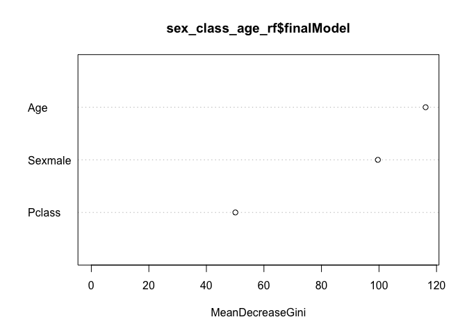

Exploring Titanic Data
================
Abby Bergman
11/6/2018

``` r
#Estimate three different logistic regression models with Survived as the response variable. You may use any combination of the predictors to estimate these models. Don’t just reuse the models from the notes.

#survival by fare
survive_fare <- glm(Survived ~ Fare, 
                    data = titanic_train, 
                    family = binomial)
summary(survive_fare)
```

    ## 
    ## Call:
    ## glm(formula = Survived ~ Fare, family = binomial, data = titanic_train)
    ## 
    ## Deviance Residuals: 
    ##     Min       1Q   Median       3Q      Max  
    ## -2.4906  -0.8878  -0.8531   1.3429   1.5942  
    ## 
    ## Coefficients:
    ##              Estimate Std. Error z value Pr(>|z|)    
    ## (Intercept) -0.941330   0.095129  -9.895  < 2e-16 ***
    ## Fare         0.015197   0.002232   6.810 9.79e-12 ***
    ## ---
    ## Signif. codes:  0 '***' 0.001 '**' 0.01 '*' 0.05 '.' 0.1 ' ' 1
    ## 
    ## (Dispersion parameter for binomial family taken to be 1)
    ## 
    ##     Null deviance: 1186.7  on 890  degrees of freedom
    ## Residual deviance: 1117.6  on 889  degrees of freedom
    ## AIC: 1121.6
    ## 
    ## Number of Fisher Scoring iterations: 4

``` r
#survival by class
survive_class <- glm(Survived ~ Pclass, 
                     data = titanic_train, 
                     family = binomial)
summary(survive_class)
```

    ## 
    ## Call:
    ## glm(formula = Survived ~ Pclass, family = binomial, data = titanic_train)
    ## 
    ## Deviance Residuals: 
    ##     Min       1Q   Median       3Q      Max  
    ## -1.4390  -0.7569  -0.7569   0.9367   1.6673  
    ## 
    ## Coefficients:
    ##             Estimate Std. Error z value Pr(>|z|)    
    ## (Intercept)  1.44679    0.20743   6.975 3.06e-12 ***
    ## Pclass      -0.85011    0.08715  -9.755  < 2e-16 ***
    ## ---
    ## Signif. codes:  0 '***' 0.001 '**' 0.01 '*' 0.05 '.' 0.1 ' ' 1
    ## 
    ## (Dispersion parameter for binomial family taken to be 1)
    ## 
    ##     Null deviance: 1186.7  on 890  degrees of freedom
    ## Residual deviance: 1084.4  on 889  degrees of freedom
    ## AIC: 1088.4
    ## 
    ## Number of Fisher Scoring iterations: 4

``` r
#survival by sex
survive_sex <- glm(Survived ~ Sex, 
                   data = titanic_train, 
                   family = binomial)
summary(survive_sex)
```

    ## 
    ## Call:
    ## glm(formula = Survived ~ Sex, family = binomial, data = titanic_train)
    ## 
    ## Deviance Residuals: 
    ##     Min       1Q   Median       3Q      Max  
    ## -1.6462  -0.6471  -0.6471   0.7725   1.8256  
    ## 
    ## Coefficients:
    ##             Estimate Std. Error z value Pr(>|z|)    
    ## (Intercept)   1.0566     0.1290   8.191 2.58e-16 ***
    ## Sexmale      -2.5137     0.1672 -15.036  < 2e-16 ***
    ## ---
    ## Signif. codes:  0 '***' 0.001 '**' 0.01 '*' 0.05 '.' 0.1 ' ' 1
    ## 
    ## (Dispersion parameter for binomial family taken to be 1)
    ## 
    ##     Null deviance: 1186.7  on 890  degrees of freedom
    ## Residual deviance:  917.8  on 889  degrees of freedom
    ## AIC: 921.8
    ## 
    ## Number of Fisher Scoring iterations: 4

``` r
#Calculate the leave-one-out-cross-validation error rate for each model. Which model performs the best?
#survive_fare

#begin cross validation
loocv_data <- loo_cv(titanic_train)
loocv_data
```

    ## # Leave-one-out cross-validation 
    ## # A tibble: 891 x 2
    ##    splits       id        
    ##    <list>       <chr>     
    ##  1 <S3: rsplit> Resample1 
    ##  2 <S3: rsplit> Resample2 
    ##  3 <S3: rsplit> Resample3 
    ##  4 <S3: rsplit> Resample4 
    ##  5 <S3: rsplit> Resample5 
    ##  6 <S3: rsplit> Resample6 
    ##  7 <S3: rsplit> Resample7 
    ##  8 <S3: rsplit> Resample8 
    ##  9 <S3: rsplit> Resample9 
    ## 10 <S3: rsplit> Resample10
    ## # ... with 881 more rows

``` r
holdout_results <- function(splits){

  mod <- glm(Survived ~ Fare, data = analysis(splits)
             )  
  holdout <- assessment(splits)
  
  res <- augment(mod, newdata = holdout) %>%
    mutate(.resid = Survived -.fitted)
  res
}

#use map
loocv_data$results <- map(loocv_data$splits, holdout_results)
loocv_data$mse <- map_dbl(loocv_data$results, ~mean(.$.resid^2))
loocv_data
```

    ## # Leave-one-out cross-validation 
    ## # A tibble: 891 x 4
    ##    splits       id         results              mse
    ##    <list>       <chr>      <list>             <dbl>
    ##  1 <S3: rsplit> Resample1  <tibble [1 × 16]> 0.104 
    ##  2 <S3: rsplit> Resample2  <tibble [1 × 16]> 0.146 
    ##  3 <S3: rsplit> Resample3  <tibble [1 × 16]> 0.220 
    ##  4 <S3: rsplit> Resample4  <tibble [1 × 16]> 0.113 
    ##  5 <S3: rsplit> Resample5  <tibble [1 × 16]> 0.103 
    ##  6 <S3: rsplit> Resample6  <tibble [1 × 16]> 0.105 
    ##  7 <S3: rsplit> Resample7  <tibble [1 × 16]> 0.461 
    ##  8 <S3: rsplit> Resample8  <tibble [1 × 16]> 0.461 
    ##  9 <S3: rsplit> Resample9  <tibble [1 × 16]> 0.0919
    ## 10 <S3: rsplit> Resample10 <tibble [1 × 16]> 0.105 
    ## # ... with 881 more rows

``` r
#overall MSE
loocv_data %>%
  summarize(mse_fare = mean(mse))
```

    ## # Leave-one-out cross-validation 
    ## # A tibble: 1 x 1
    ##   mse_fare
    ##      <dbl>
    ## 1    0.222

The mean squared error for survival by fare is 0.222

``` r
#survive_class

#begin cross validation
loocv_data <- loo_cv(titanic_train)
loocv_data
```

    ## # Leave-one-out cross-validation 
    ## # A tibble: 891 x 2
    ##    splits       id        
    ##    <list>       <chr>     
    ##  1 <S3: rsplit> Resample1 
    ##  2 <S3: rsplit> Resample2 
    ##  3 <S3: rsplit> Resample3 
    ##  4 <S3: rsplit> Resample4 
    ##  5 <S3: rsplit> Resample5 
    ##  6 <S3: rsplit> Resample6 
    ##  7 <S3: rsplit> Resample7 
    ##  8 <S3: rsplit> Resample8 
    ##  9 <S3: rsplit> Resample9 
    ## 10 <S3: rsplit> Resample10
    ## # ... with 881 more rows

``` r
#

holdout_results <- function(splits){

  mod <- glm(Survived ~ Pclass, data = analysis(splits)
             )  
  holdout <- assessment(splits)
  
  res <- augment(mod, newdata = holdout) %>%
    mutate(.resid = Survived -.fitted)
  res
}

#use map
loocv_data$results <- map(loocv_data$splits, holdout_results)
loocv_data$mse <- map_dbl(loocv_data$results, ~mean(.$.resid^2))
loocv_data
```

    ## # Leave-one-out cross-validation 
    ## # A tibble: 891 x 4
    ##    splits       id         results              mse
    ##    <list>       <chr>      <list>             <dbl>
    ##  1 <S3: rsplit> Resample1  <tibble [1 × 16]> 0.0616
    ##  2 <S3: rsplit> Resample2  <tibble [1 × 16]> 0.415 
    ##  3 <S3: rsplit> Resample3  <tibble [1 × 16]> 0.568 
    ##  4 <S3: rsplit> Resample4  <tibble [1 × 16]> 0.129 
    ##  5 <S3: rsplit> Resample5  <tibble [1 × 16]> 0.0616
    ##  6 <S3: rsplit> Resample6  <tibble [1 × 16]> 0.198 
    ##  7 <S3: rsplit> Resample7  <tibble [1 × 16]> 0.415 
    ##  8 <S3: rsplit> Resample8  <tibble [1 × 16]> 0.0616
    ##  9 <S3: rsplit> Resample9  <tibble [1 × 16]> 0.0616
    ## 10 <S3: rsplit> Resample10 <tibble [1 × 16]> 0.415 
    ## # ... with 881 more rows

``` r
#overall MSE
loocv_data %>%
  summarize(mse_class = mean(mse))
```

    ## # Leave-one-out cross-validation 
    ## # A tibble: 1 x 1
    ##   mse_class
    ##       <dbl>
    ## 1     0.210

The mean squared error rate for survival by class is 0.210.

``` r
#survive_sex

#begin cross validation
loocv_data <- loo_cv(titanic_train)

#

holdout_results <- function(splits){

  mod <- glm(Survived ~ Sex, data = analysis(splits)
             )  
  holdout <- assessment(splits)
  
  res <- augment(mod, newdata = holdout) %>%
    mutate(.resid = Survived -.fitted)
  res
}

#use map
loocv_data$results <- map(loocv_data$splits, holdout_results)
loocv_data$mse <- map_dbl(loocv_data$results, ~mean(.$.resid^2))
loocv_data
```

    ## # Leave-one-out cross-validation 
    ## # A tibble: 891 x 4
    ##    splits       id         results              mse
    ##    <list>       <chr>      <list>             <dbl>
    ##  1 <S3: rsplit> Resample1  <tibble [1 × 16]> 0.660 
    ##  2 <S3: rsplit> Resample2  <tibble [1 × 16]> 0.660 
    ##  3 <S3: rsplit> Resample3  <tibble [1 × 16]> 0.0358
    ##  4 <S3: rsplit> Resample4  <tibble [1 × 16]> 0.0670
    ##  5 <S3: rsplit> Resample5  <tibble [1 × 16]> 0.0358
    ##  6 <S3: rsplit> Resample6  <tibble [1 × 16]> 0.0358
    ##  7 <S3: rsplit> Resample7  <tibble [1 × 16]> 0.0358
    ##  8 <S3: rsplit> Resample8  <tibble [1 × 16]> 0.0358
    ##  9 <S3: rsplit> Resample9  <tibble [1 × 16]> 0.0358
    ## 10 <S3: rsplit> Resample10 <tibble [1 × 16]> 0.660 
    ## # ... with 881 more rows

``` r
#overall MSE
loocv_data %>%
  summarize(mse_sex = mean(mse))
```

    ## # Leave-one-out cross-validation 
    ## # A tibble: 1 x 1
    ##   mse_sex
    ##     <dbl>
    ## 1   0.167

The mean squared error rate for survival by sex is 0.167. Because survival by sex has the lowest MSE (.167), the model of survival by sex is the best.

``` r
#Now estimate three random forest models. Generate random forests with 500 trees apiece.
#convert qualitative to factors so that random forest will work
titanic_tree_data <- titanic_train %>%
  mutate(Survived = if_else(Survived == 1, "Survived", "Died"),
         Survived = as.factor(Survived),
         Sex = as.factor(Sex))

#make data ready for rf
titanic_rf_data <- titanic_tree_data %>%
  select(Survived, Pclass, Sex, Age, SibSp, Parch, Fare, Embarked) %>% #select variables I want
  na.omit() #get rid of NAs
titanic_rf_data
```

    ##     Survived Pclass    Sex   Age SibSp Parch     Fare Embarked
    ## 1       Died      3   male 22.00     1     0   7.2500        S
    ## 2   Survived      1 female 38.00     1     0  71.2833        C
    ## 3   Survived      3 female 26.00     0     0   7.9250        S
    ## 4   Survived      1 female 35.00     1     0  53.1000        S
    ## 5       Died      3   male 35.00     0     0   8.0500        S
    ## 7       Died      1   male 54.00     0     0  51.8625        S
    ## 8       Died      3   male  2.00     3     1  21.0750        S
    ## 9   Survived      3 female 27.00     0     2  11.1333        S
    ## 10  Survived      2 female 14.00     1     0  30.0708        C
    ## 11  Survived      3 female  4.00     1     1  16.7000        S
    ## 12  Survived      1 female 58.00     0     0  26.5500        S
    ## 13      Died      3   male 20.00     0     0   8.0500        S
    ## 14      Died      3   male 39.00     1     5  31.2750        S
    ## 15      Died      3 female 14.00     0     0   7.8542        S
    ## 16  Survived      2 female 55.00     0     0  16.0000        S
    ## 17      Died      3   male  2.00     4     1  29.1250        Q
    ## 19      Died      3 female 31.00     1     0  18.0000        S
    ## 21      Died      2   male 35.00     0     0  26.0000        S
    ## 22  Survived      2   male 34.00     0     0  13.0000        S
    ## 23  Survived      3 female 15.00     0     0   8.0292        Q
    ## 24  Survived      1   male 28.00     0     0  35.5000        S
    ## 25      Died      3 female  8.00     3     1  21.0750        S
    ## 26  Survived      3 female 38.00     1     5  31.3875        S
    ## 28      Died      1   male 19.00     3     2 263.0000        S
    ## 31      Died      1   male 40.00     0     0  27.7208        C
    ## 34      Died      2   male 66.00     0     0  10.5000        S
    ## 35      Died      1   male 28.00     1     0  82.1708        C
    ## 36      Died      1   male 42.00     1     0  52.0000        S
    ## 38      Died      3   male 21.00     0     0   8.0500        S
    ## 39      Died      3 female 18.00     2     0  18.0000        S
    ## 40  Survived      3 female 14.00     1     0  11.2417        C
    ## 41      Died      3 female 40.00     1     0   9.4750        S
    ## 42      Died      2 female 27.00     1     0  21.0000        S
    ## 44  Survived      2 female  3.00     1     2  41.5792        C
    ## 45  Survived      3 female 19.00     0     0   7.8792        Q
    ## 50      Died      3 female 18.00     1     0  17.8000        S
    ## 51      Died      3   male  7.00     4     1  39.6875        S
    ## 52      Died      3   male 21.00     0     0   7.8000        S
    ## 53  Survived      1 female 49.00     1     0  76.7292        C
    ## 54  Survived      2 female 29.00     1     0  26.0000        S
    ## 55      Died      1   male 65.00     0     1  61.9792        C
    ## 57  Survived      2 female 21.00     0     0  10.5000        S
    ## 58      Died      3   male 28.50     0     0   7.2292        C
    ## 59  Survived      2 female  5.00     1     2  27.7500        S
    ## 60      Died      3   male 11.00     5     2  46.9000        S
    ## 61      Died      3   male 22.00     0     0   7.2292        C
    ## 62  Survived      1 female 38.00     0     0  80.0000         
    ## 63      Died      1   male 45.00     1     0  83.4750        S
    ## 64      Died      3   male  4.00     3     2  27.9000        S
    ## 67  Survived      2 female 29.00     0     0  10.5000        S
    ## 68      Died      3   male 19.00     0     0   8.1583        S
    ## 69  Survived      3 female 17.00     4     2   7.9250        S
    ## 70      Died      3   male 26.00     2     0   8.6625        S
    ## 71      Died      2   male 32.00     0     0  10.5000        S
    ## 72      Died      3 female 16.00     5     2  46.9000        S
    ## 73      Died      2   male 21.00     0     0  73.5000        S
    ## 74      Died      3   male 26.00     1     0  14.4542        C
    ## 75  Survived      3   male 32.00     0     0  56.4958        S
    ## 76      Died      3   male 25.00     0     0   7.6500        S
    ## 79  Survived      2   male  0.83     0     2  29.0000        S
    ## 80  Survived      3 female 30.00     0     0  12.4750        S
    ## 81      Died      3   male 22.00     0     0   9.0000        S
    ## 82  Survived      3   male 29.00     0     0   9.5000        S
    ## 84      Died      1   male 28.00     0     0  47.1000        S
    ## 85  Survived      2 female 17.00     0     0  10.5000        S
    ## 86  Survived      3 female 33.00     3     0  15.8500        S
    ## 87      Died      3   male 16.00     1     3  34.3750        S
    ## 89  Survived      1 female 23.00     3     2 263.0000        S
    ## 90      Died      3   male 24.00     0     0   8.0500        S
    ## 91      Died      3   male 29.00     0     0   8.0500        S
    ## 92      Died      3   male 20.00     0     0   7.8542        S
    ## 93      Died      1   male 46.00     1     0  61.1750        S
    ## 94      Died      3   male 26.00     1     2  20.5750        S
    ## 95      Died      3   male 59.00     0     0   7.2500        S
    ## 97      Died      1   male 71.00     0     0  34.6542        C
    ## 98  Survived      1   male 23.00     0     1  63.3583        C
    ## 99  Survived      2 female 34.00     0     1  23.0000        S
    ## 100     Died      2   male 34.00     1     0  26.0000        S
    ## 101     Died      3 female 28.00     0     0   7.8958        S
    ## 103     Died      1   male 21.00     0     1  77.2875        S
    ## 104     Died      3   male 33.00     0     0   8.6542        S
    ## 105     Died      3   male 37.00     2     0   7.9250        S
    ## 106     Died      3   male 28.00     0     0   7.8958        S
    ## 107 Survived      3 female 21.00     0     0   7.6500        S
    ## 109     Died      3   male 38.00     0     0   7.8958        S
    ## 111     Died      1   male 47.00     0     0  52.0000        S
    ## 112     Died      3 female 14.50     1     0  14.4542        C
    ## 113     Died      3   male 22.00     0     0   8.0500        S
    ## 114     Died      3 female 20.00     1     0   9.8250        S
    ## 115     Died      3 female 17.00     0     0  14.4583        C
    ## 116     Died      3   male 21.00     0     0   7.9250        S
    ## 117     Died      3   male 70.50     0     0   7.7500        Q
    ## 118     Died      2   male 29.00     1     0  21.0000        S
    ## 119     Died      1   male 24.00     0     1 247.5208        C
    ## 120     Died      3 female  2.00     4     2  31.2750        S
    ## 121     Died      2   male 21.00     2     0  73.5000        S
    ## 123     Died      2   male 32.50     1     0  30.0708        C
    ## 124 Survived      2 female 32.50     0     0  13.0000        S
    ## 125     Died      1   male 54.00     0     1  77.2875        S
    ## 126 Survived      3   male 12.00     1     0  11.2417        C
    ## 128 Survived      3   male 24.00     0     0   7.1417        S
    ## 130     Died      3   male 45.00     0     0   6.9750        S
    ## 131     Died      3   male 33.00     0     0   7.8958        C
    ## 132     Died      3   male 20.00     0     0   7.0500        S
    ## 133     Died      3 female 47.00     1     0  14.5000        S
    ## 134 Survived      2 female 29.00     1     0  26.0000        S
    ## 135     Died      2   male 25.00     0     0  13.0000        S
    ## 136     Died      2   male 23.00     0     0  15.0458        C
    ## 137 Survived      1 female 19.00     0     2  26.2833        S
    ## 138     Died      1   male 37.00     1     0  53.1000        S
    ## 139     Died      3   male 16.00     0     0   9.2167        S
    ## 140     Died      1   male 24.00     0     0  79.2000        C
    ## 142 Survived      3 female 22.00     0     0   7.7500        S
    ## 143 Survived      3 female 24.00     1     0  15.8500        S
    ## 144     Died      3   male 19.00     0     0   6.7500        Q
    ## 145     Died      2   male 18.00     0     0  11.5000        S
    ## 146     Died      2   male 19.00     1     1  36.7500        S
    ## 147 Survived      3   male 27.00     0     0   7.7958        S
    ## 148     Died      3 female  9.00     2     2  34.3750        S
    ## 149     Died      2   male 36.50     0     2  26.0000        S
    ## 150     Died      2   male 42.00     0     0  13.0000        S
    ## 151     Died      2   male 51.00     0     0  12.5250        S
    ## 152 Survived      1 female 22.00     1     0  66.6000        S
    ## 153     Died      3   male 55.50     0     0   8.0500        S
    ## 154     Died      3   male 40.50     0     2  14.5000        S
    ## 156     Died      1   male 51.00     0     1  61.3792        C
    ## 157 Survived      3 female 16.00     0     0   7.7333        Q
    ## 158     Died      3   male 30.00     0     0   8.0500        S
    ## 161     Died      3   male 44.00     0     1  16.1000        S
    ## 162 Survived      2 female 40.00     0     0  15.7500        S
    ## 163     Died      3   male 26.00     0     0   7.7750        S
    ## 164     Died      3   male 17.00     0     0   8.6625        S
    ## 165     Died      3   male  1.00     4     1  39.6875        S
    ## 166 Survived      3   male  9.00     0     2  20.5250        S
    ## 168     Died      3 female 45.00     1     4  27.9000        S
    ## 170     Died      3   male 28.00     0     0  56.4958        S
    ## 171     Died      1   male 61.00     0     0  33.5000        S
    ## 172     Died      3   male  4.00     4     1  29.1250        Q
    ## 173 Survived      3 female  1.00     1     1  11.1333        S
    ## 174     Died      3   male 21.00     0     0   7.9250        S
    ## 175     Died      1   male 56.00     0     0  30.6958        C
    ## 176     Died      3   male 18.00     1     1   7.8542        S
    ## 178     Died      1 female 50.00     0     0  28.7125        C
    ## 179     Died      2   male 30.00     0     0  13.0000        S
    ## 180     Died      3   male 36.00     0     0   0.0000        S
    ## 183     Died      3   male  9.00     4     2  31.3875        S
    ## 184 Survived      2   male  1.00     2     1  39.0000        S
    ## 185 Survived      3 female  4.00     0     2  22.0250        S
    ## 188 Survived      1   male 45.00     0     0  26.5500        S
    ## 189     Died      3   male 40.00     1     1  15.5000        Q
    ## 190     Died      3   male 36.00     0     0   7.8958        S
    ## 191 Survived      2 female 32.00     0     0  13.0000        S
    ## 192     Died      2   male 19.00     0     0  13.0000        S
    ## 193 Survived      3 female 19.00     1     0   7.8542        S
    ## 194 Survived      2   male  3.00     1     1  26.0000        S
    ## 195 Survived      1 female 44.00     0     0  27.7208        C
    ## 196 Survived      1 female 58.00     0     0 146.5208        C
    ## 198     Died      3   male 42.00     0     1   8.4042        S
    ## 200     Died      2 female 24.00     0     0  13.0000        S
    ## 201     Died      3   male 28.00     0     0   9.5000        S
    ## 203     Died      3   male 34.00     0     0   6.4958        S
    ## 204     Died      3   male 45.50     0     0   7.2250        C
    ## 205 Survived      3   male 18.00     0     0   8.0500        S
    ## 206     Died      3 female  2.00     0     1  10.4625        S
    ## 207     Died      3   male 32.00     1     0  15.8500        S
    ## 208 Survived      3   male 26.00     0     0  18.7875        C
    ## 209 Survived      3 female 16.00     0     0   7.7500        Q
    ## 210 Survived      1   male 40.00     0     0  31.0000        C
    ## 211     Died      3   male 24.00     0     0   7.0500        S
    ## 212 Survived      2 female 35.00     0     0  21.0000        S
    ## 213     Died      3   male 22.00     0     0   7.2500        S
    ## 214     Died      2   male 30.00     0     0  13.0000        S
    ## 216 Survived      1 female 31.00     1     0 113.2750        C
    ## 217 Survived      3 female 27.00     0     0   7.9250        S
    ## 218     Died      2   male 42.00     1     0  27.0000        S
    ## 219 Survived      1 female 32.00     0     0  76.2917        C
    ## 220     Died      2   male 30.00     0     0  10.5000        S
    ## 221 Survived      3   male 16.00     0     0   8.0500        S
    ## 222     Died      2   male 27.00     0     0  13.0000        S
    ## 223     Died      3   male 51.00     0     0   8.0500        S
    ## 225 Survived      1   male 38.00     1     0  90.0000        S
    ## 226     Died      3   male 22.00     0     0   9.3500        S
    ## 227 Survived      2   male 19.00     0     0  10.5000        S
    ## 228     Died      3   male 20.50     0     0   7.2500        S
    ## 229     Died      2   male 18.00     0     0  13.0000        S
    ## 231 Survived      1 female 35.00     1     0  83.4750        S
    ## 232     Died      3   male 29.00     0     0   7.7750        S
    ## 233     Died      2   male 59.00     0     0  13.5000        S
    ## 234 Survived      3 female  5.00     4     2  31.3875        S
    ## 235     Died      2   male 24.00     0     0  10.5000        S
    ## 237     Died      2   male 44.00     1     0  26.0000        S
    ## 238 Survived      2 female  8.00     0     2  26.2500        S
    ## 239     Died      2   male 19.00     0     0  10.5000        S
    ## 240     Died      2   male 33.00     0     0  12.2750        S
    ## 243     Died      2   male 29.00     0     0  10.5000        S
    ## 244     Died      3   male 22.00     0     0   7.1250        S
    ## 245     Died      3   male 30.00     0     0   7.2250        C
    ## 246     Died      1   male 44.00     2     0  90.0000        Q
    ## 247     Died      3 female 25.00     0     0   7.7750        S
    ## 248 Survived      2 female 24.00     0     2  14.5000        S
    ## 249 Survived      1   male 37.00     1     1  52.5542        S
    ## 250     Died      2   male 54.00     1     0  26.0000        S
    ## 252     Died      3 female 29.00     1     1  10.4625        S
    ## 253     Died      1   male 62.00     0     0  26.5500        S
    ## 254     Died      3   male 30.00     1     0  16.1000        S
    ## 255     Died      3 female 41.00     0     2  20.2125        S
    ## 256 Survived      3 female 29.00     0     2  15.2458        C
    ## 258 Survived      1 female 30.00     0     0  86.5000        S
    ## 259 Survived      1 female 35.00     0     0 512.3292        C
    ## 260 Survived      2 female 50.00     0     1  26.0000        S
    ## 262 Survived      3   male  3.00     4     2  31.3875        S
    ## 263     Died      1   male 52.00     1     1  79.6500        S
    ## 264     Died      1   male 40.00     0     0   0.0000        S
    ## 266     Died      2   male 36.00     0     0  10.5000        S
    ## 267     Died      3   male 16.00     4     1  39.6875        S
    ## 268 Survived      3   male 25.00     1     0   7.7750        S
    ## 269 Survived      1 female 58.00     0     1 153.4625        S
    ## 270 Survived      1 female 35.00     0     0 135.6333        S
    ## 272 Survived      3   male 25.00     0     0   0.0000        S
    ## 273 Survived      2 female 41.00     0     1  19.5000        S
    ## 274     Died      1   male 37.00     0     1  29.7000        C
    ## 276 Survived      1 female 63.00     1     0  77.9583        S
    ## 277     Died      3 female 45.00     0     0   7.7500        S
    ## 279     Died      3   male  7.00     4     1  29.1250        Q
    ## 280 Survived      3 female 35.00     1     1  20.2500        S
    ## 281     Died      3   male 65.00     0     0   7.7500        Q
    ## 282     Died      3   male 28.00     0     0   7.8542        S
    ## 283     Died      3   male 16.00     0     0   9.5000        S
    ## 284 Survived      3   male 19.00     0     0   8.0500        S
    ## 286     Died      3   male 33.00     0     0   8.6625        C
    ## 287 Survived      3   male 30.00     0     0   9.5000        S
    ## 288     Died      3   male 22.00     0     0   7.8958        S
    ## 289 Survived      2   male 42.00     0     0  13.0000        S
    ## 290 Survived      3 female 22.00     0     0   7.7500        Q
    ## 291 Survived      1 female 26.00     0     0  78.8500        S
    ## 292 Survived      1 female 19.00     1     0  91.0792        C
    ## 293     Died      2   male 36.00     0     0  12.8750        C
    ## 294     Died      3 female 24.00     0     0   8.8500        S
    ## 295     Died      3   male 24.00     0     0   7.8958        S
    ## 297     Died      3   male 23.50     0     0   7.2292        C
    ## 298     Died      1 female  2.00     1     2 151.5500        S
    ## 300 Survived      1 female 50.00     0     1 247.5208        C
    ## 303     Died      3   male 19.00     0     0   0.0000        S
    ## 306 Survived      1   male  0.92     1     2 151.5500        S
    ## 308 Survived      1 female 17.00     1     0 108.9000        C
    ## 309     Died      2   male 30.00     1     0  24.0000        C
    ## 310 Survived      1 female 30.00     0     0  56.9292        C
    ## 311 Survived      1 female 24.00     0     0  83.1583        C
    ## 312 Survived      1 female 18.00     2     2 262.3750        C
    ## 313     Died      2 female 26.00     1     1  26.0000        S
    ## 314     Died      3   male 28.00     0     0   7.8958        S
    ## 315     Died      2   male 43.00     1     1  26.2500        S
    ## 316 Survived      3 female 26.00     0     0   7.8542        S
    ## 317 Survived      2 female 24.00     1     0  26.0000        S
    ## 318     Died      2   male 54.00     0     0  14.0000        S
    ## 319 Survived      1 female 31.00     0     2 164.8667        S
    ## 320 Survived      1 female 40.00     1     1 134.5000        C
    ## 321     Died      3   male 22.00     0     0   7.2500        S
    ## 322     Died      3   male 27.00     0     0   7.8958        S
    ## 323 Survived      2 female 30.00     0     0  12.3500        Q
    ## 324 Survived      2 female 22.00     1     1  29.0000        S
    ## 326 Survived      1 female 36.00     0     0 135.6333        C
    ## 327     Died      3   male 61.00     0     0   6.2375        S
    ## 328 Survived      2 female 36.00     0     0  13.0000        S
    ## 329 Survived      3 female 31.00     1     1  20.5250        S
    ## 330 Survived      1 female 16.00     0     1  57.9792        C
    ## 332     Died      1   male 45.50     0     0  28.5000        S
    ## 333     Died      1   male 38.00     0     1 153.4625        S
    ## 334     Died      3   male 16.00     2     0  18.0000        S
    ## 337     Died      1   male 29.00     1     0  66.6000        S
    ## 338 Survived      1 female 41.00     0     0 134.5000        C
    ## 339 Survived      3   male 45.00     0     0   8.0500        S
    ## 340     Died      1   male 45.00     0     0  35.5000        S
    ## 341 Survived      2   male  2.00     1     1  26.0000        S
    ## 342 Survived      1 female 24.00     3     2 263.0000        S
    ## 343     Died      2   male 28.00     0     0  13.0000        S
    ## 344     Died      2   male 25.00     0     0  13.0000        S
    ## 345     Died      2   male 36.00     0     0  13.0000        S
    ## 346 Survived      2 female 24.00     0     0  13.0000        S
    ## 347 Survived      2 female 40.00     0     0  13.0000        S
    ## 349 Survived      3   male  3.00     1     1  15.9000        S
    ## 350     Died      3   male 42.00     0     0   8.6625        S
    ## 351     Died      3   male 23.00     0     0   9.2250        S
    ## 353     Died      3   male 15.00     1     1   7.2292        C
    ## 354     Died      3   male 25.00     1     0  17.8000        S
    ## 356     Died      3   male 28.00     0     0   9.5000        S
    ## 357 Survived      1 female 22.00     0     1  55.0000        S
    ## 358     Died      2 female 38.00     0     0  13.0000        S
    ## 361     Died      3   male 40.00     1     4  27.9000        S
    ## 362     Died      2   male 29.00     1     0  27.7208        C
    ## 363     Died      3 female 45.00     0     1  14.4542        C
    ## 364     Died      3   male 35.00     0     0   7.0500        S
    ## 366     Died      3   male 30.00     0     0   7.2500        S
    ## 367 Survived      1 female 60.00     1     0  75.2500        C
    ## 370 Survived      1 female 24.00     0     0  69.3000        C
    ## 371 Survived      1   male 25.00     1     0  55.4417        C
    ## 372     Died      3   male 18.00     1     0   6.4958        S
    ## 373     Died      3   male 19.00     0     0   8.0500        S
    ## 374     Died      1   male 22.00     0     0 135.6333        C
    ## 375     Died      3 female  3.00     3     1  21.0750        S
    ## 377 Survived      3 female 22.00     0     0   7.2500        S
    ## 378     Died      1   male 27.00     0     2 211.5000        C
    ## 379     Died      3   male 20.00     0     0   4.0125        C
    ## 380     Died      3   male 19.00     0     0   7.7750        S
    ## 381 Survived      1 female 42.00     0     0 227.5250        C
    ## 382 Survived      3 female  1.00     0     2  15.7417        C
    ## 383     Died      3   male 32.00     0     0   7.9250        S
    ## 384 Survived      1 female 35.00     1     0  52.0000        S
    ## 386     Died      2   male 18.00     0     0  73.5000        S
    ## 387     Died      3   male  1.00     5     2  46.9000        S
    ## 388 Survived      2 female 36.00     0     0  13.0000        S
    ## 390 Survived      2 female 17.00     0     0  12.0000        C
    ## 391 Survived      1   male 36.00     1     2 120.0000        S
    ## 392 Survived      3   male 21.00     0     0   7.7958        S
    ## 393     Died      3   male 28.00     2     0   7.9250        S
    ## 394 Survived      1 female 23.00     1     0 113.2750        C
    ## 395 Survived      3 female 24.00     0     2  16.7000        S
    ## 396     Died      3   male 22.00     0     0   7.7958        S
    ## 397     Died      3 female 31.00     0     0   7.8542        S
    ## 398     Died      2   male 46.00     0     0  26.0000        S
    ## 399     Died      2   male 23.00     0     0  10.5000        S
    ## 400 Survived      2 female 28.00     0     0  12.6500        S
    ## 401 Survived      3   male 39.00     0     0   7.9250        S
    ## 402     Died      3   male 26.00     0     0   8.0500        S
    ## 403     Died      3 female 21.00     1     0   9.8250        S
    ## 404     Died      3   male 28.00     1     0  15.8500        S
    ## 405     Died      3 female 20.00     0     0   8.6625        S
    ## 406     Died      2   male 34.00     1     0  21.0000        S
    ## 407     Died      3   male 51.00     0     0   7.7500        S
    ## 408 Survived      2   male  3.00     1     1  18.7500        S
    ## 409     Died      3   male 21.00     0     0   7.7750        S
    ## 413 Survived      1 female 33.00     1     0  90.0000        Q
    ## 415 Survived      3   male 44.00     0     0   7.9250        S
    ## 417 Survived      2 female 34.00     1     1  32.5000        S
    ## 418 Survived      2 female 18.00     0     2  13.0000        S
    ## 419     Died      2   male 30.00     0     0  13.0000        S
    ## 420     Died      3 female 10.00     0     2  24.1500        S
    ## 422     Died      3   male 21.00     0     0   7.7333        Q
    ## 423     Died      3   male 29.00     0     0   7.8750        S
    ## 424     Died      3 female 28.00     1     1  14.4000        S
    ## 425     Died      3   male 18.00     1     1  20.2125        S
    ## 427 Survived      2 female 28.00     1     0  26.0000        S
    ## 428 Survived      2 female 19.00     0     0  26.0000        S
    ## 430 Survived      3   male 32.00     0     0   8.0500        S
    ## 431 Survived      1   male 28.00     0     0  26.5500        S
    ## 433 Survived      2 female 42.00     1     0  26.0000        S
    ## 434     Died      3   male 17.00     0     0   7.1250        S
    ## 435     Died      1   male 50.00     1     0  55.9000        S
    ## 436 Survived      1 female 14.00     1     2 120.0000        S
    ## 437     Died      3 female 21.00     2     2  34.3750        S
    ## 438 Survived      2 female 24.00     2     3  18.7500        S
    ## 439     Died      1   male 64.00     1     4 263.0000        S
    ## 440     Died      2   male 31.00     0     0  10.5000        S
    ## 441 Survived      2 female 45.00     1     1  26.2500        S
    ## 442     Died      3   male 20.00     0     0   9.5000        S
    ## 443     Died      3   male 25.00     1     0   7.7750        S
    ## 444 Survived      2 female 28.00     0     0  13.0000        S
    ## 446 Survived      1   male  4.00     0     2  81.8583        S
    ## 447 Survived      2 female 13.00     0     1  19.5000        S
    ## 448 Survived      1   male 34.00     0     0  26.5500        S
    ## 449 Survived      3 female  5.00     2     1  19.2583        C
    ## 450 Survived      1   male 52.00     0     0  30.5000        S
    ## 451     Died      2   male 36.00     1     2  27.7500        S
    ## 453     Died      1   male 30.00     0     0  27.7500        C
    ## 454 Survived      1   male 49.00     1     0  89.1042        C
    ## 456 Survived      3   male 29.00     0     0   7.8958        C
    ## 457     Died      1   male 65.00     0     0  26.5500        S
    ## 459 Survived      2 female 50.00     0     0  10.5000        S
    ## 461 Survived      1   male 48.00     0     0  26.5500        S
    ## 462     Died      3   male 34.00     0     0   8.0500        S
    ## 463     Died      1   male 47.00     0     0  38.5000        S
    ## 464     Died      2   male 48.00     0     0  13.0000        S
    ## 466     Died      3   male 38.00     0     0   7.0500        S
    ## 468     Died      1   male 56.00     0     0  26.5500        S
    ## 470 Survived      3 female  0.75     2     1  19.2583        C
    ## 472     Died      3   male 38.00     0     0   8.6625        S
    ## 473 Survived      2 female 33.00     1     2  27.7500        S
    ## 474 Survived      2 female 23.00     0     0  13.7917        C
    ## 475     Died      3 female 22.00     0     0   9.8375        S
    ## 477     Died      2   male 34.00     1     0  21.0000        S
    ## 478     Died      3   male 29.00     1     0   7.0458        S
    ## 479     Died      3   male 22.00     0     0   7.5208        S
    ## 480 Survived      3 female  2.00     0     1  12.2875        S
    ## 481     Died      3   male  9.00     5     2  46.9000        S
    ## 483     Died      3   male 50.00     0     0   8.0500        S
    ## 484 Survived      3 female 63.00     0     0   9.5875        S
    ## 485 Survived      1   male 25.00     1     0  91.0792        C
    ## 487 Survived      1 female 35.00     1     0  90.0000        S
    ## 488     Died      1   male 58.00     0     0  29.7000        C
    ## 489     Died      3   male 30.00     0     0   8.0500        S
    ## 490 Survived      3   male  9.00     1     1  15.9000        S
    ## 492     Died      3   male 21.00     0     0   7.2500        S
    ## 493     Died      1   male 55.00     0     0  30.5000        S
    ## 494     Died      1   male 71.00     0     0  49.5042        C
    ## 495     Died      3   male 21.00     0     0   8.0500        S
    ## 497 Survived      1 female 54.00     1     0  78.2667        C
    ## 499     Died      1 female 25.00     1     2 151.5500        S
    ## 500     Died      3   male 24.00     0     0   7.7958        S
    ## 501     Died      3   male 17.00     0     0   8.6625        S
    ## 502     Died      3 female 21.00     0     0   7.7500        Q
    ## 504     Died      3 female 37.00     0     0   9.5875        S
    ## 505 Survived      1 female 16.00     0     0  86.5000        S
    ## 506     Died      1   male 18.00     1     0 108.9000        C
    ## 507 Survived      2 female 33.00     0     2  26.0000        S
    ## 509     Died      3   male 28.00     0     0  22.5250        S
    ## 510 Survived      3   male 26.00     0     0  56.4958        S
    ## 511 Survived      3   male 29.00     0     0   7.7500        Q
    ## 513 Survived      1   male 36.00     0     0  26.2875        S
    ## 514 Survived      1 female 54.00     1     0  59.4000        C
    ## 515     Died      3   male 24.00     0     0   7.4958        S
    ## 516     Died      1   male 47.00     0     0  34.0208        S
    ## 517 Survived      2 female 34.00     0     0  10.5000        S
    ## 519 Survived      2 female 36.00     1     0  26.0000        S
    ## 520     Died      3   male 32.00     0     0   7.8958        S
    ## 521 Survived      1 female 30.00     0     0  93.5000        S
    ## 522     Died      3   male 22.00     0     0   7.8958        S
    ## 524 Survived      1 female 44.00     0     1  57.9792        C
    ## 526     Died      3   male 40.50     0     0   7.7500        Q
    ## 527 Survived      2 female 50.00     0     0  10.5000        S
    ## 529     Died      3   male 39.00     0     0   7.9250        S
    ## 530     Died      2   male 23.00     2     1  11.5000        S
    ## 531 Survived      2 female  2.00     1     1  26.0000        S
    ## 533     Died      3   male 17.00     1     1   7.2292        C
    ## 535     Died      3 female 30.00     0     0   8.6625        S
    ## 536 Survived      2 female  7.00     0     2  26.2500        S
    ## 537     Died      1   male 45.00     0     0  26.5500        S
    ## 538 Survived      1 female 30.00     0     0 106.4250        C
    ## 540 Survived      1 female 22.00     0     2  49.5000        C
    ## 541 Survived      1 female 36.00     0     2  71.0000        S
    ## 542     Died      3 female  9.00     4     2  31.2750        S
    ## 543     Died      3 female 11.00     4     2  31.2750        S
    ## 544 Survived      2   male 32.00     1     0  26.0000        S
    ## 545     Died      1   male 50.00     1     0 106.4250        C
    ## 546     Died      1   male 64.00     0     0  26.0000        S
    ## 547 Survived      2 female 19.00     1     0  26.0000        S
    ## 549     Died      3   male 33.00     1     1  20.5250        S
    ## 550 Survived      2   male  8.00     1     1  36.7500        S
    ## 551 Survived      1   male 17.00     0     2 110.8833        C
    ## 552     Died      2   male 27.00     0     0  26.0000        S
    ## 554 Survived      3   male 22.00     0     0   7.2250        C
    ## 555 Survived      3 female 22.00     0     0   7.7750        S
    ## 556     Died      1   male 62.00     0     0  26.5500        S
    ## 557 Survived      1 female 48.00     1     0  39.6000        C
    ## 559 Survived      1 female 39.00     1     1  79.6500        S
    ## 560 Survived      3 female 36.00     1     0  17.4000        S
    ## 562     Died      3   male 40.00     0     0   7.8958        S
    ## 563     Died      2   male 28.00     0     0  13.5000        S
    ## 566     Died      3   male 24.00     2     0  24.1500        S
    ## 567     Died      3   male 19.00     0     0   7.8958        S
    ## 568     Died      3 female 29.00     0     4  21.0750        S
    ## 570 Survived      3   male 32.00     0     0   7.8542        S
    ## 571 Survived      2   male 62.00     0     0  10.5000        S
    ## 572 Survived      1 female 53.00     2     0  51.4792        S
    ## 573 Survived      1   male 36.00     0     0  26.3875        S
    ## 575     Died      3   male 16.00     0     0   8.0500        S
    ## 576     Died      3   male 19.00     0     0  14.5000        S
    ## 577 Survived      2 female 34.00     0     0  13.0000        S
    ## 578 Survived      1 female 39.00     1     0  55.9000        S
    ## 580 Survived      3   male 32.00     0     0   7.9250        S
    ## 581 Survived      2 female 25.00     1     1  30.0000        S
    ## 582 Survived      1 female 39.00     1     1 110.8833        C
    ## 583     Died      2   male 54.00     0     0  26.0000        S
    ## 584     Died      1   male 36.00     0     0  40.1250        C
    ## 586 Survived      1 female 18.00     0     2  79.6500        S
    ## 587     Died      2   male 47.00     0     0  15.0000        S
    ## 588 Survived      1   male 60.00     1     1  79.2000        C
    ## 589     Died      3   male 22.00     0     0   8.0500        S
    ## 591     Died      3   male 35.00     0     0   7.1250        S
    ## 592 Survived      1 female 52.00     1     0  78.2667        C
    ## 593     Died      3   male 47.00     0     0   7.2500        S
    ## 595     Died      2   male 37.00     1     0  26.0000        S
    ## 596     Died      3   male 36.00     1     1  24.1500        S
    ## 598     Died      3   male 49.00     0     0   0.0000        S
    ## 600 Survived      1   male 49.00     1     0  56.9292        C
    ## 601 Survived      2 female 24.00     2     1  27.0000        S
    ## 604     Died      3   male 44.00     0     0   8.0500        S
    ## 605 Survived      1   male 35.00     0     0  26.5500        C
    ## 606     Died      3   male 36.00     1     0  15.5500        S
    ## 607     Died      3   male 30.00     0     0   7.8958        S
    ## 608 Survived      1   male 27.00     0     0  30.5000        S
    ## 609 Survived      2 female 22.00     1     2  41.5792        C
    ## 610 Survived      1 female 40.00     0     0 153.4625        S
    ## 611     Died      3 female 39.00     1     5  31.2750        S
    ## 615     Died      3   male 35.00     0     0   8.0500        S
    ## 616 Survived      2 female 24.00     1     2  65.0000        S
    ## 617     Died      3   male 34.00     1     1  14.4000        S
    ## 618     Died      3 female 26.00     1     0  16.1000        S
    ## 619 Survived      2 female  4.00     2     1  39.0000        S
    ## 620     Died      2   male 26.00     0     0  10.5000        S
    ## 621     Died      3   male 27.00     1     0  14.4542        C
    ## 622 Survived      1   male 42.00     1     0  52.5542        S
    ## 623 Survived      3   male 20.00     1     1  15.7417        C
    ## 624     Died      3   male 21.00     0     0   7.8542        S
    ## 625     Died      3   male 21.00     0     0  16.1000        S
    ## 626     Died      1   male 61.00     0     0  32.3208        S
    ## 627     Died      2   male 57.00     0     0  12.3500        Q
    ## 628 Survived      1 female 21.00     0     0  77.9583        S
    ## 629     Died      3   male 26.00     0     0   7.8958        S
    ## 631 Survived      1   male 80.00     0     0  30.0000        S
    ## 632     Died      3   male 51.00     0     0   7.0542        S
    ## 633 Survived      1   male 32.00     0     0  30.5000        C
    ## 635     Died      3 female  9.00     3     2  27.9000        S
    ## 636 Survived      2 female 28.00     0     0  13.0000        S
    ## 637     Died      3   male 32.00     0     0   7.9250        S
    ## 638     Died      2   male 31.00     1     1  26.2500        S
    ## 639     Died      3 female 41.00     0     5  39.6875        S
    ## 641     Died      3   male 20.00     0     0   7.8542        S
    ## 642 Survived      1 female 24.00     0     0  69.3000        C
    ## 643     Died      3 female  2.00     3     2  27.9000        S
    ## 645 Survived      3 female  0.75     2     1  19.2583        C
    ## 646 Survived      1   male 48.00     1     0  76.7292        C
    ## 647     Died      3   male 19.00     0     0   7.8958        S
    ## 648 Survived      1   male 56.00     0     0  35.5000        C
    ## 650 Survived      3 female 23.00     0     0   7.5500        S
    ## 652 Survived      2 female 18.00     0     1  23.0000        S
    ## 653     Died      3   male 21.00     0     0   8.4333        S
    ## 655     Died      3 female 18.00     0     0   6.7500        Q
    ## 656     Died      2   male 24.00     2     0  73.5000        S
    ## 658     Died      3 female 32.00     1     1  15.5000        Q
    ## 659     Died      2   male 23.00     0     0  13.0000        S
    ## 660     Died      1   male 58.00     0     2 113.2750        C
    ## 661 Survived      1   male 50.00     2     0 133.6500        S
    ## 662     Died      3   male 40.00     0     0   7.2250        C
    ## 663     Died      1   male 47.00     0     0  25.5875        S
    ## 664     Died      3   male 36.00     0     0   7.4958        S
    ## 665 Survived      3   male 20.00     1     0   7.9250        S
    ## 666     Died      2   male 32.00     2     0  73.5000        S
    ## 667     Died      2   male 25.00     0     0  13.0000        S
    ## 669     Died      3   male 43.00     0     0   8.0500        S
    ## 671 Survived      2 female 40.00     1     1  39.0000        S
    ## 672     Died      1   male 31.00     1     0  52.0000        S
    ## 673     Died      2   male 70.00     0     0  10.5000        S
    ## 674 Survived      2   male 31.00     0     0  13.0000        S
    ## 676     Died      3   male 18.00     0     0   7.7750        S
    ## 677     Died      3   male 24.50     0     0   8.0500        S
    ## 678 Survived      3 female 18.00     0     0   9.8417        S
    ## 679     Died      3 female 43.00     1     6  46.9000        S
    ## 680 Survived      1   male 36.00     0     1 512.3292        C
    ## 682 Survived      1   male 27.00     0     0  76.7292        C
    ## 683     Died      3   male 20.00     0     0   9.2250        S
    ## 684     Died      3   male 14.00     5     2  46.9000        S
    ## 685     Died      2   male 60.00     1     1  39.0000        S
    ## 686     Died      2   male 25.00     1     2  41.5792        C
    ## 687     Died      3   male 14.00     4     1  39.6875        S
    ## 688     Died      3   male 19.00     0     0  10.1708        S
    ## 689     Died      3   male 18.00     0     0   7.7958        S
    ## 690 Survived      1 female 15.00     0     1 211.3375        S
    ## 691 Survived      1   male 31.00     1     0  57.0000        S
    ## 692 Survived      3 female  4.00     0     1  13.4167        C
    ## 694     Died      3   male 25.00     0     0   7.2250        C
    ## 695     Died      1   male 60.00     0     0  26.5500        S
    ## 696     Died      2   male 52.00     0     0  13.5000        S
    ## 697     Died      3   male 44.00     0     0   8.0500        S
    ## 699     Died      1   male 49.00     1     1 110.8833        C
    ## 700     Died      3   male 42.00     0     0   7.6500        S
    ## 701 Survived      1 female 18.00     1     0 227.5250        C
    ## 702 Survived      1   male 35.00     0     0  26.2875        S
    ## 703     Died      3 female 18.00     0     1  14.4542        C
    ## 704     Died      3   male 25.00     0     0   7.7417        Q
    ## 705     Died      3   male 26.00     1     0   7.8542        S
    ## 706     Died      2   male 39.00     0     0  26.0000        S
    ## 707 Survived      2 female 45.00     0     0  13.5000        S
    ## 708 Survived      1   male 42.00     0     0  26.2875        S
    ## 709 Survived      1 female 22.00     0     0 151.5500        S
    ## 711 Survived      1 female 24.00     0     0  49.5042        C
    ## 713 Survived      1   male 48.00     1     0  52.0000        S
    ## 714     Died      3   male 29.00     0     0   9.4833        S
    ## 715     Died      2   male 52.00     0     0  13.0000        S
    ## 716     Died      3   male 19.00     0     0   7.6500        S
    ## 717 Survived      1 female 38.00     0     0 227.5250        C
    ## 718 Survived      2 female 27.00     0     0  10.5000        S
    ## 720     Died      3   male 33.00     0     0   7.7750        S
    ## 721 Survived      2 female  6.00     0     1  33.0000        S
    ## 722     Died      3   male 17.00     1     0   7.0542        S
    ## 723     Died      2   male 34.00     0     0  13.0000        S
    ## 724     Died      2   male 50.00     0     0  13.0000        S
    ## 725 Survived      1   male 27.00     1     0  53.1000        S
    ## 726     Died      3   male 20.00     0     0   8.6625        S
    ## 727 Survived      2 female 30.00     3     0  21.0000        S
    ## 729     Died      2   male 25.00     1     0  26.0000        S
    ## 730     Died      3 female 25.00     1     0   7.9250        S
    ## 731 Survived      1 female 29.00     0     0 211.3375        S
    ## 732     Died      3   male 11.00     0     0  18.7875        C
    ## 734     Died      2   male 23.00     0     0  13.0000        S
    ## 735     Died      2   male 23.00     0     0  13.0000        S
    ## 736     Died      3   male 28.50     0     0  16.1000        S
    ## 737     Died      3 female 48.00     1     3  34.3750        S
    ## 738 Survived      1   male 35.00     0     0 512.3292        C
    ## 742     Died      1   male 36.00     1     0  78.8500        S
    ## 743 Survived      1 female 21.00     2     2 262.3750        C
    ## 744     Died      3   male 24.00     1     0  16.1000        S
    ## 745 Survived      3   male 31.00     0     0   7.9250        S
    ## 746     Died      1   male 70.00     1     1  71.0000        S
    ## 747     Died      3   male 16.00     1     1  20.2500        S
    ## 748 Survived      2 female 30.00     0     0  13.0000        S
    ## 749     Died      1   male 19.00     1     0  53.1000        S
    ## 750     Died      3   male 31.00     0     0   7.7500        Q
    ## 751 Survived      2 female  4.00     1     1  23.0000        S
    ## 752 Survived      3   male  6.00     0     1  12.4750        S
    ## 753     Died      3   male 33.00     0     0   9.5000        S
    ## 754     Died      3   male 23.00     0     0   7.8958        S
    ## 755 Survived      2 female 48.00     1     2  65.0000        S
    ## 756 Survived      2   male  0.67     1     1  14.5000        S
    ## 757     Died      3   male 28.00     0     0   7.7958        S
    ## 758     Died      2   male 18.00     0     0  11.5000        S
    ## 759     Died      3   male 34.00     0     0   8.0500        S
    ## 760 Survived      1 female 33.00     0     0  86.5000        S
    ## 762     Died      3   male 41.00     0     0   7.1250        S
    ## 763 Survived      3   male 20.00     0     0   7.2292        C
    ## 764 Survived      1 female 36.00     1     2 120.0000        S
    ## 765     Died      3   male 16.00     0     0   7.7750        S
    ## 766 Survived      1 female 51.00     1     0  77.9583        S
    ## 768     Died      3 female 30.50     0     0   7.7500        Q
    ## 770     Died      3   male 32.00     0     0   8.3625        S
    ## 771     Died      3   male 24.00     0     0   9.5000        S
    ## 772     Died      3   male 48.00     0     0   7.8542        S
    ## 773     Died      2 female 57.00     0     0  10.5000        S
    ## 775 Survived      2 female 54.00     1     3  23.0000        S
    ## 776     Died      3   male 18.00     0     0   7.7500        S
    ## 778 Survived      3 female  5.00     0     0  12.4750        S
    ## 780 Survived      1 female 43.00     0     1 211.3375        S
    ## 781 Survived      3 female 13.00     0     0   7.2292        C
    ## 782 Survived      1 female 17.00     1     0  57.0000        S
    ## 783     Died      1   male 29.00     0     0  30.0000        S
    ## 785     Died      3   male 25.00     0     0   7.0500        S
    ## 786     Died      3   male 25.00     0     0   7.2500        S
    ## 787 Survived      3 female 18.00     0     0   7.4958        S
    ## 788     Died      3   male  8.00     4     1  29.1250        Q
    ## 789 Survived      3   male  1.00     1     2  20.5750        S
    ## 790     Died      1   male 46.00     0     0  79.2000        C
    ## 792     Died      2   male 16.00     0     0  26.0000        S
    ## 795     Died      3   male 25.00     0     0   7.8958        S
    ## 796     Died      2   male 39.00     0     0  13.0000        S
    ## 797 Survived      1 female 49.00     0     0  25.9292        S
    ## 798 Survived      3 female 31.00     0     0   8.6833        S
    ## 799     Died      3   male 30.00     0     0   7.2292        C
    ## 800     Died      3 female 30.00     1     1  24.1500        S
    ## 801     Died      2   male 34.00     0     0  13.0000        S
    ## 802 Survived      2 female 31.00     1     1  26.2500        S
    ## 803 Survived      1   male 11.00     1     2 120.0000        S
    ## 804 Survived      3   male  0.42     0     1   8.5167        C
    ## 805 Survived      3   male 27.00     0     0   6.9750        S
    ## 806     Died      3   male 31.00     0     0   7.7750        S
    ## 807     Died      1   male 39.00     0     0   0.0000        S
    ## 808     Died      3 female 18.00     0     0   7.7750        S
    ## 809     Died      2   male 39.00     0     0  13.0000        S
    ## 810 Survived      1 female 33.00     1     0  53.1000        S
    ## 811     Died      3   male 26.00     0     0   7.8875        S
    ## 812     Died      3   male 39.00     0     0  24.1500        S
    ## 813     Died      2   male 35.00     0     0  10.5000        S
    ## 814     Died      3 female  6.00     4     2  31.2750        S
    ## 815     Died      3   male 30.50     0     0   8.0500        S
    ## 817     Died      3 female 23.00     0     0   7.9250        S
    ## 818     Died      2   male 31.00     1     1  37.0042        C
    ## 819     Died      3   male 43.00     0     0   6.4500        S
    ## 820     Died      3   male 10.00     3     2  27.9000        S
    ## 821 Survived      1 female 52.00     1     1  93.5000        S
    ## 822 Survived      3   male 27.00     0     0   8.6625        S
    ## 823     Died      1   male 38.00     0     0   0.0000        S
    ## 824 Survived      3 female 27.00     0     1  12.4750        S
    ## 825     Died      3   male  2.00     4     1  39.6875        S
    ## 828 Survived      2   male  1.00     0     2  37.0042        C
    ## 830 Survived      1 female 62.00     0     0  80.0000         
    ## 831 Survived      3 female 15.00     1     0  14.4542        C
    ## 832 Survived      2   male  0.83     1     1  18.7500        S
    ## 834     Died      3   male 23.00     0     0   7.8542        S
    ## 835     Died      3   male 18.00     0     0   8.3000        S
    ## 836 Survived      1 female 39.00     1     1  83.1583        C
    ## 837     Died      3   male 21.00     0     0   8.6625        S
    ## 839 Survived      3   male 32.00     0     0  56.4958        S
    ## 841     Died      3   male 20.00     0     0   7.9250        S
    ## 842     Died      2   male 16.00     0     0  10.5000        S
    ## 843 Survived      1 female 30.00     0     0  31.0000        C
    ## 844     Died      3   male 34.50     0     0   6.4375        C
    ## 845     Died      3   male 17.00     0     0   8.6625        S
    ## 846     Died      3   male 42.00     0     0   7.5500        S
    ## 848     Died      3   male 35.00     0     0   7.8958        C
    ## 849     Died      2   male 28.00     0     1  33.0000        S
    ## 851     Died      3   male  4.00     4     2  31.2750        S
    ## 852     Died      3   male 74.00     0     0   7.7750        S
    ## 853     Died      3 female  9.00     1     1  15.2458        C
    ## 854 Survived      1 female 16.00     0     1  39.4000        S
    ## 855     Died      2 female 44.00     1     0  26.0000        S
    ## 856 Survived      3 female 18.00     0     1   9.3500        S
    ## 857 Survived      1 female 45.00     1     1 164.8667        S
    ## 858 Survived      1   male 51.00     0     0  26.5500        S
    ## 859 Survived      3 female 24.00     0     3  19.2583        C
    ## 861     Died      3   male 41.00     2     0  14.1083        S
    ## 862     Died      2   male 21.00     1     0  11.5000        S
    ## 863 Survived      1 female 48.00     0     0  25.9292        S
    ## 865     Died      2   male 24.00     0     0  13.0000        S
    ## 866 Survived      2 female 42.00     0     0  13.0000        S
    ## 867 Survived      2 female 27.00     1     0  13.8583        C
    ## 868     Died      1   male 31.00     0     0  50.4958        S
    ## 870 Survived      3   male  4.00     1     1  11.1333        S
    ## 871     Died      3   male 26.00     0     0   7.8958        S
    ## 872 Survived      1 female 47.00     1     1  52.5542        S
    ## 873     Died      1   male 33.00     0     0   5.0000        S
    ## 874     Died      3   male 47.00     0     0   9.0000        S
    ## 875 Survived      2 female 28.00     1     0  24.0000        C
    ## 876 Survived      3 female 15.00     0     0   7.2250        C
    ## 877     Died      3   male 20.00     0     0   9.8458        S
    ## 878     Died      3   male 19.00     0     0   7.8958        S
    ## 880 Survived      1 female 56.00     0     1  83.1583        C
    ## 881 Survived      2 female 25.00     0     1  26.0000        S
    ## 882     Died      3   male 33.00     0     0   7.8958        S
    ## 883     Died      3 female 22.00     0     0  10.5167        S
    ## 884     Died      2   male 28.00     0     0  10.5000        S
    ## 885     Died      3   male 25.00     0     0   7.0500        S
    ## 886     Died      3 female 39.00     0     5  29.1250        Q
    ## 887     Died      2   male 27.00     0     0  13.0000        S
    ## 888 Survived      1 female 19.00     0     0  30.0000        S
    ## 890 Survived      1   male 26.00     0     0  30.0000        C
    ## 891     Died      3   male 32.00     0     0   7.7500        Q

``` r
#run rf for age + Pclass
age_class_rf <- train(Survived ~ Age + Pclass, data = titanic_rf_data,
                   method = "rf",
                   ntree = 500, #how many trees
                   trControl = trainControl(method = "oob")) #set method
```

    ## note: only 1 unique complexity parameters in default grid. Truncating the grid to 1 .

``` r
age_class_rf
```

    ## Random Forest 
    ## 
    ## 714 samples
    ##   2 predictor
    ##   2 classes: 'Died', 'Survived' 
    ## 
    ## No pre-processing
    ## Resampling results:
    ## 
    ##   Accuracy   Kappa    
    ##   0.6862745  0.3284176
    ## 
    ## Tuning parameter 'mtry' was held constant at a value of 2

``` r
#run rf for sex + Pclass
sex_class_rf <- train(Survived ~ Sex + Pclass, data = titanic_rf_data,
                   method = "rf",
                   ntree = 500,
                   trControl = trainControl(method = "oob"))
```

    ## note: only 1 unique complexity parameters in default grid. Truncating the grid to 1 .

``` r
sex_class_rf
```

    ## Random Forest 
    ## 
    ## 714 samples
    ##   2 predictor
    ##   2 classes: 'Died', 'Survived' 
    ## 
    ## No pre-processing
    ## Resampling results:
    ## 
    ##   Accuracy   Kappa    
    ##   0.7913165  0.5341426
    ## 
    ## Tuning parameter 'mtry' was held constant at a value of 2

``` r
#run rf for sex + Pclass
sex_class_age_rf <- train(Survived ~ Sex + Pclass + Age, data = titanic_rf_data,
                   method = "rf",
                   ntree = 500,
                   trControl = trainControl(method = "oob"))
```

    ## note: only 2 unique complexity parameters in default grid. Truncating the grid to 2 .

``` r
#Generate variable importance plots for each random forest model. Which variables seem the most important?
#age and class
randomForest::varImpPlot(age_class_rf$finalModel)
```


``` r
#sex and class
randomForest::varImpPlot(sex_class_rf$finalModel)
```


``` r
#sex, class, and age
randomForest::varImpPlot(sex_class_age_rf$finalModel)
```

 The three variable difference plots allow us to see which variables are most important in each model. For the age and class random forest, age is the more important variable. For the sex and class random forest, sex is the more important varible. For the random forest that takes into account sex, age, and class, age is the most important variable, followed by sex and class.

``` r
#Calculate the out-of-bag error rate for each random forest model. Which performs the best?
#age and class
age_class_rf$finalModel
```

    ## 
    ## Call:
    ##  randomForest(x = x, y = y, ntree = 500, mtry = param$mtry) 
    ##                Type of random forest: classification
    ##                      Number of trees: 500
    ## No. of variables tried at each split: 2
    ## 
    ##         OOB estimate of  error rate: 31.23%
    ## Confusion matrix:
    ##          Died Survived class.error
    ## Died      341       83   0.1957547
    ## Survived  140      150   0.4827586

``` r
#sex and class
sex_class_rf$finalModel
```

    ## 
    ## Call:
    ##  randomForest(x = x, y = y, ntree = 500, mtry = param$mtry) 
    ##                Type of random forest: classification
    ##                      Number of trees: 500
    ## No. of variables tried at each split: 2
    ## 
    ##         OOB estimate of  error rate: 20.87%
    ## Confusion matrix:
    ##          Died Survived class.error
    ## Died      415        9  0.02122642
    ## Survived  140      150  0.48275862

``` r
#sex, class, and age
sex_class_age_rf$finalModel
```

    ## 
    ## Call:
    ##  randomForest(x = x, y = y, ntree = 500, mtry = param$mtry) 
    ##                Type of random forest: classification
    ##                      Number of trees: 500
    ## No. of variables tried at each split: 3
    ## 
    ##         OOB estimate of  error rate: 18.49%
    ## Confusion matrix:
    ##          Died Survived class.error
    ## Died      379       45   0.1061321
    ## Survived   87      203   0.3000000

The out of bag estimates for both the age and class random forest and the sex and class random forest is 20.87%. The out of bag estimate for the age, sex, class random forest is 18.35%. The random forest that included more variables performed better.
